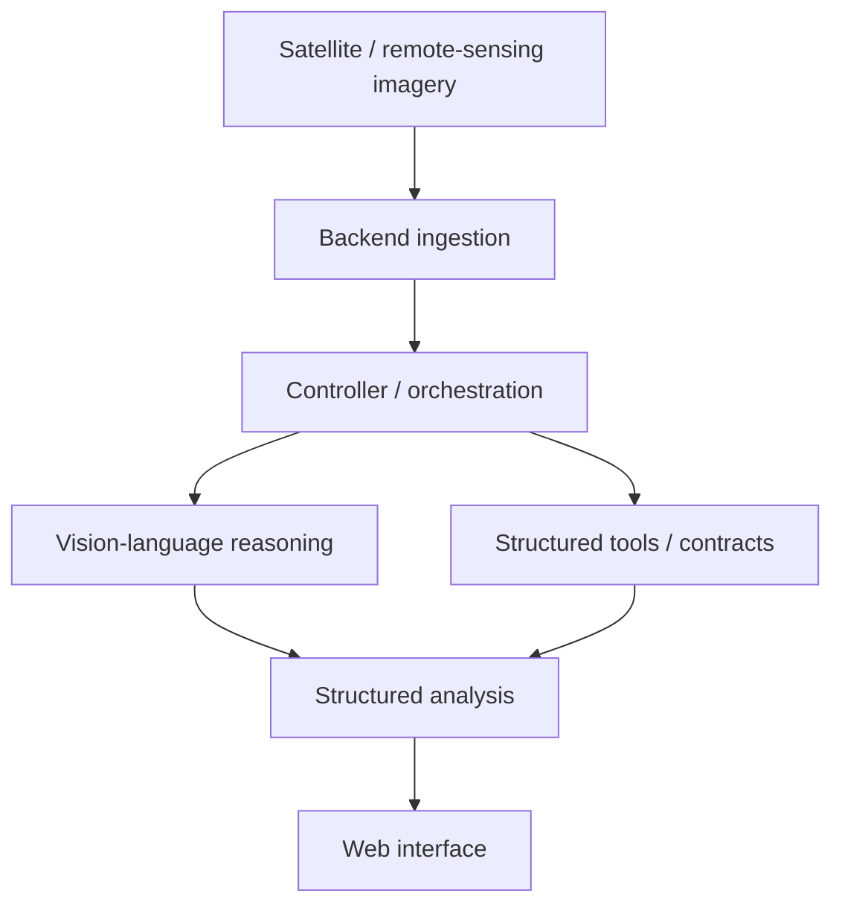

# SatQuery AI

**Agentic vision-language workspace for reasoning over remote-sensing imagery.**

SatQuery AI explores how a multimodal assistant can turn satellite imagery into an interactive analysis workflow rather than a one-shot model prediction.

## Architecture



## Repository structure

```text
satellite-ai/
├── backend/        # API / storage / backend tests
├── controller/     # controller package, contracts, mocks, tests
├── frontend-code/  # user-facing web application
└── setup.py        # Python package configuration
```

The repository deliberately separates the **interface**, **backend**, and **controller/orchestration** layers so the reasoning workflow can evolve independently of the UI.

## What the project explores

- Vision-language reasoning over satellite imagery
- Agent-oriented task orchestration
- Structured contracts between system components
- Backend storage and API workflows
- A dedicated frontend for interacting with remote-sensing analysis
- Mocked components and tests for controller development

## Why remote sensing

Satellite imagery is information-dense but difficult to query directly. SatQuery AI is built around the idea that a user should be able to ask higher-level questions about an image and let a multimodal system coordinate the intermediate analysis.

## Status

Research prototype. This repository demonstrates the application structure and orchestration work; it should not be interpreted as a validated geospatial intelligence product.

## Development

Backend and controller dependencies are maintained within their respective directories. The frontend lives under `frontend-code/` with its own JavaScript package configuration.

For detailed setup, see the README and dependency files inside each component directory.