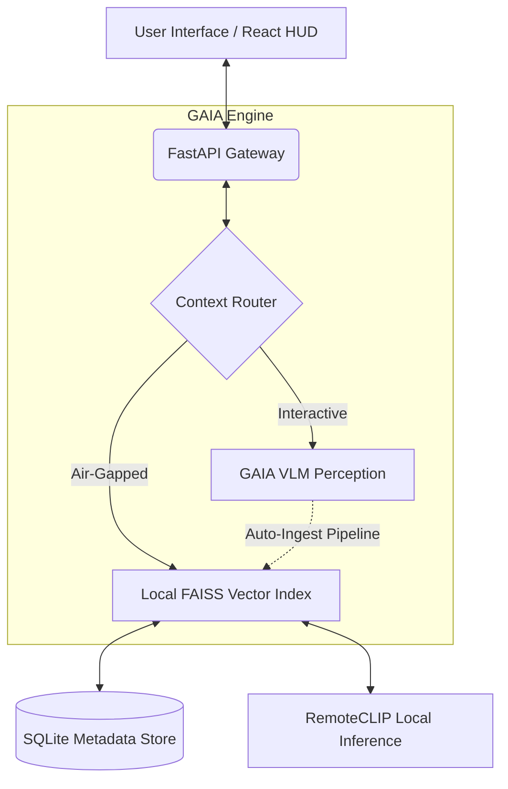

<div align="center">
  
  
  # GAIA 
  **Geospatial Artificial Intelligence Assistant**

  <p align="center">
    An agentic vision-language assistant for remote-sensing imagery, delivering real-time geospatial perception and autonomous change detection.
  </p>

  [](https://opensource.org/licenses/MIT)
  [](https://react.dev)
  [](https://fastapi.tiangolo.com/)
  [](https://github.com/facebookresearch/faiss)
</div>

---

## 🌍 Overview

**GAIA** is a unified, multi-modal perception engine built specifically to understand and interpret satellite and aerial imagery. It bridges the gap between raw pixels and semantic understanding by allowing analysts to interact with complex geospatial data through natural language and autonomous scanning agents.

> **⚠️ PS 26227 Evaluator Note (Air-Gapped Compliance):** 
> To strictly adhere to the on-premises/air-gapped requirement (2.2.7), this reproducibility package isolates the **GAIA Offline Archive** as the primary evaluation target. The Offline Archive (including FAISS, RemoteCLIP embeddings, SQLite timelines, and change scanners) operates **100% locally** with zero external network calls. The *Interactive VLM Mode* is included to demonstrate future UX architectures; if run on an air-gapped machine, it degrades gracefully to a local mock unless a local GPU-bound VLM (e.g., LLaVA) is explicitly provisioned.

## ✨ Core Capabilities

### 🧠 GAIA Interactive (VLM Engine)
The interactive hub of the system. Upload massive scenes and leverage an advanced Vision-Language Model interface:
- **Visual Question Answering (VQA)**: Ask natural language questions about satellite scenes (e.g., *"How many airplanes are visible on the tarmac?"* or *"Describe the extent of the flooding."*)
- **Bi-Temporal Change Detection**: Upload "Before" and "After" scenes to receive a detailed, structural breakdown of what evolved in the region.
- **Native 16-bit GeoTIFF Support**: Upload raw, multi-band `.tif` files directly. GAIA dynamically normalizes and previews radiometric data on the fly while explicitly preserving **CRS, geotransform, and acquisition telemetry** per tile.

### 🛡️ GAIA Offline (Archive Mode)
A fully localized, air-gapped vector retrieval system built on **FAISS** and a lightweight vision transformer (`RemoteCLIP-ViT-B-32`).
- **Semantic Tile Search & Clustering**: Query historical tiles using natural language, or use **Find Similar** to perform unsupervised clustering, finding comparable sites from a single seed observation. Search results can be tightly bounded using **area, date-range, and sensor filters**.
- **Autonomous Change Scanning**: The archive continuously scans historical time-series data to surface anomalies. Outputs are heavily structured per PS 26227 requirements:
  - **Typed Changes**: Categorizes into specific phenomenologies (e.g., *construction*, *clearance*, *water extent*, *roads*).
  - **Evidence Validation**: Provides the earliest supporting observation and a normalized confidence score per change.
  - **False-Alarm Suppression**: Employs quality masking (SCL), radiometric normalization, and seasonal baseline anchoring to suppress false positives.
- **Analyst Review Queue**: A built-in workflow engine where automated detections can be reviewed. Analysts can confirm or reject candidates, and this feedback dynamically reranks the queue. Candidates feature full before/after evidence alongside processing histories for complete auditability.

### 🔄 Intelligent Auto-Ingestion
The system is self-building. Any imagery uploaded and analyzed during an Interactive session is automatically stretched, chipped, embedded, and silently ingested into the local SQLite/FAISS archive, fully preserving georeferencing metadata.

---

## 🏗️ System Architecture



---

## 📚 Documentation & Deliverables

Please refer to the following documents for deep dives into the system design, operations, and evaluation metrics:

- 🏗️ **[Architecture Note](docs/architecture.md)**: A detailed written description of the system design and component interactions.
- ⚙️ **[Ingestion Procedure](docs/ingestion.md)**: Step-by-step instructions to build the offline index from scratch or dynamically append new imagery.
- 📜 **[Model & Dataset Provenance](docs/provenance.md)**: Origins, licenses, and packaging information for the GAIA models and baseline datasets.
- 📊 **[Reproducible Evaluation Report](docs/evaluation.md)**: Hardware specifications, query latencies, footprint, and index build times for the offline system.
- 📦 **[Reproducibility Package](reproducibility/README.md)**: Manifests and scripts to stage the wheelhouse and model weights for 100% offline installation.

---

## 🚀 Getting Started

### Prerequisites
- Node.js (v18+)
- Python 3.10+
- `pip`

### 1. Initialize the Backend Core

The backend powers both the VLM endpoints and the local embedding network.

```bash
cd backend
python -m venv venv

# Activate Virtual Environment (Windows)
venv\Scripts\activate
# Activate Virtual Environment (Unix/MacOS)
# source venv/bin/activate

# Install core dependencies
pip install -r requirements.txt
```

Launch the FastAPI application:
```bash
python -m uvicorn app.main:app --host 127.0.0.1 --port 8000
```

### 2. Launch the Frontend HUD

Open a new terminal window to spin up the React Vite server:

```bash
cd frontend-code
npm install
npm run dev
```

Navigate to `http://localhost:5173` in your browser. 

---

## 🎮 Interface Modes

Use the global navigation toggle at the top of the interface to switch contexts seamlessly:

- **GAIA INTERACTIVE (VLM)**: Your primary interactive workspace for querying imagery and conducting ad-hoc bi-temporal change assessments.
2. **OFFLINE ARCHIVE (INDEX)**: Your local intelligence database. Search your ingested history, run archive-wide change scans, and manage your review queue.

---

<div align="center">
  <p><i>Building a smarter planetary understanding.</i></p>
</div>
